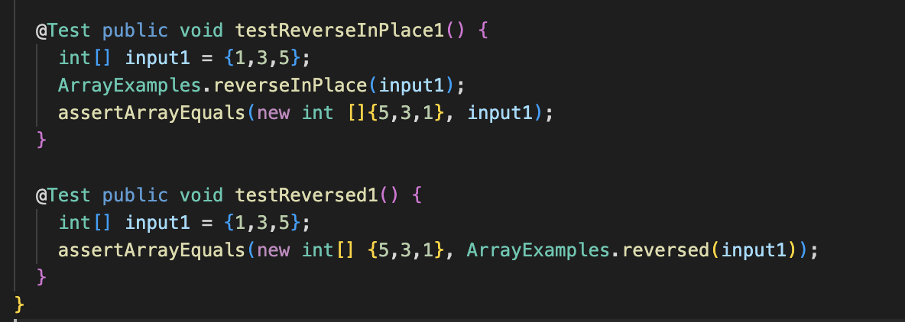

# Part 1

# Part 2 
The issue with ReverseInPlace's bug is that it swaps an index that requires modification with an index that has already been altered, resulting in an incorrect output like {1,2,3} becoming {3,1,3}.
In order to fix this bug we created a temporary variable to store the values.   
int temp = arr[i]; 
 `arr[i] = arr[arr.length - i - 1]; 
 arr[arr.length - i - 1] = temp;`

# Part 3
