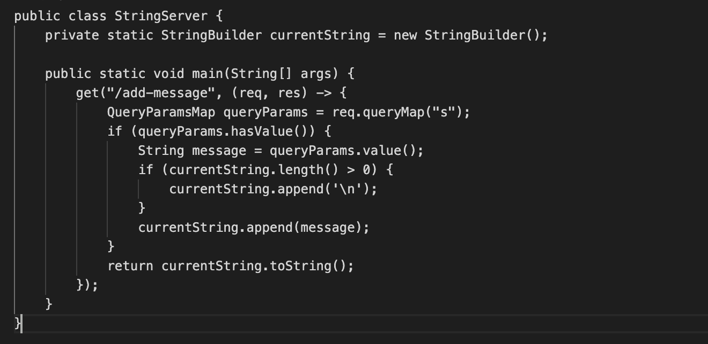

# Part 1

s
In my code I used the addMessage method that takes in the arguments.
`@RequestParam(value = "s", defaultValue = "") String message`.
It receives the value of s as a query parameter for the url.
The relevant fields of the class are `private StringBuilder runningString` which stores the string and appends a new string.
When there is a specific request the addMessage method calls the argument and the if condition runs to see if the argument is not empty.
If it isn't it appends a new line and send it to the runningString field, which returns the value of the runningString
 

# Part 2 
The issue with ReverseInPlace's bug is that it swaps an index that requires modification with an index that has already been altered, resulting in an incorrect output like `[1,2,3]` becoming `[3,1,3]`.   
An input that that gave the correct output was `[1, 1]`

This input gave an error.
`@Test
 public void testReversed1() {
  int [] input1 = {1, 2, 3};
  assertArrayequals(new int[] {3, 2, 1}, ArrayExamples.reversed(input1));`
  
This input outputed correctly.
`@Test
 public void testReversed1() {
  int [] input1 = {1, 1};
  assertArrayequals(new int[] {1, 1}, ArrayExamples.reversed(input1));`
 
In order to fix this bug we created a temporary variable to store the values.
`int temp = arr[i]; 
arr[i] = arr[arr.length - i - 1]; 
arr[arr.length - i - 1] = temp;`

# Part 3
I learned during lab how to debug code efficiently and write test cases to find where the problem lies in the code.
We saw that even if the cdoe works for some test cases that doesn't mean it works for all inputs. 
We need to try many scnenarios that will display a possible wrong output, which can help us find if there is a bug or not.
